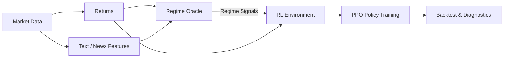

<!-- <p align="center">
  
</p>
 -->
<h1 align="center">R²PA</h1>

<p align="center">
  <b>Regime-aware Reinforcement Learning for Portfolio Allocation</b>
</p>

<p align="center">
  <sub>
    A research-oriented RL system for regime-conditioned portfolio decision making<br/>
    <i>implemented in <code>Portfolio-RL-Agent-Lab</code></i>
  </sub>
</p>

R²PA is a **research-oriented reinforcement learning system** for portfolio allocation under **latent market regimes**.

The core idea is to **separate expensive regime inference from downstream decision learning**:

- Market regimes are inferred by a pluggable **Regime Oracle** (heuristics or local LLMs)
- Regime signals are consumed as structured state by a **PPO-based portfolio policy**
- Training-time intelligence is decoupled from inference-time execution

This repo serves as a sandbox for studying **regime-aware decision policies**, not as a trading bot or alpha signal generator.

## Why R²PA

Most RL trading examples attempt to learn market structure end-to-end from price data.
R²PA instead treats **market regime as an explicit latent state**, supplied by an external oracle
and used to condition portfolio decisions.

This repo is designed to explore:

- **Regime-aware portfolio allocation** rather than price prediction
- **Teacher / oracle → policy** decoupling for realistic deployment constraints
- A clean, artifact-driven pipeline from data to evaluation


## Architecture (high level)



## Repository layout

- `portfolio_rl_agent_lab/data/` — data download + dataset building
- `portfolio_rl_agent_lab/text/` — news loading + text feature extraction
- `portfolio_rl_agent_lab/llm/` — regime feature builders (heuristic/local LLM)
- `portfolio_rl_agent_lab/student/` — student model pipeline
- `portfolio_rl_agent_lab/env/` — portfolio environment
- `portfolio_rl_agent_lab/train/` — PPO training
- `portfolio_rl_agent_lab/eval/` — backtest, benchmarks, diagnostics
- `portfolio_rl_agent_lab/pipeline/` — orchestrated pipelines
- `portfolio_rl_agent_lab/cli/` — CLI entrypoints
- `artifacts/` — generated data/models/logs (gitignored)

## Quickstart (uv)

```bash
uv venv --python 3.12
source .venv/bin/activate
uv sync
```

### Minimal run (heuristic regime)

```bash
uv run python -m portfolio_rl_agent_lab.data.download
uv run python -m portfolio_rl_agent_lab.data.make_dataset
uv run python -m portfolio_rl_agent_lab.text.build_text_features
uv run python -m portfolio_rl_agent_lab.llm.build_regime_features
uv run python -m portfolio_rl_agent_lab.train.train_ppo
uv run python -m portfolio_rl_agent_lab.eval.benchmarks
uv run python -m portfolio_rl_agent_lab.eval.diagnostics
```

## CLI

After `uv sync`, the `prl` command is available. If you don’t want to install the script, use the module form: `uv run python -m portfolio_rl_agent_lab.cli ...`.

```bash
prl data download
prl data news-alpaca --days 5
prl rl train
prl rl benchmarks
```

## Pipeline

```bash
prl pipeline data
prl pipeline text
prl pipeline regime --source heuristic
prl pipeline student
prl pipeline rl
prl pipeline all --source heuristic
```

## Inference (single date)

```bash
prl infer run --model artifacts/models/ppo_portfolio --asof 2025-12-31
```

Live Yahoo data (latest available date)
```bash
prl infer run --live-yahoo --lookback-days 180
```

Real-time regime (heuristic)
```bash
prl infer run --live-yahoo --lookback-days 180 --regime-source heuristic
```

Real-time regime (local LLM + live news)
```bash
prl infer run --live-yahoo --live-news --regime-source local --news-lookback-days 5
```

Note: use the same ticker order as the model was trained on (defaults to `CFG.tickers`).

## Notes

- Large artifacts are excluded from git: `artifacts/`, `.venv/`
- Regime Oracle is swappable without touching env/policy logic
