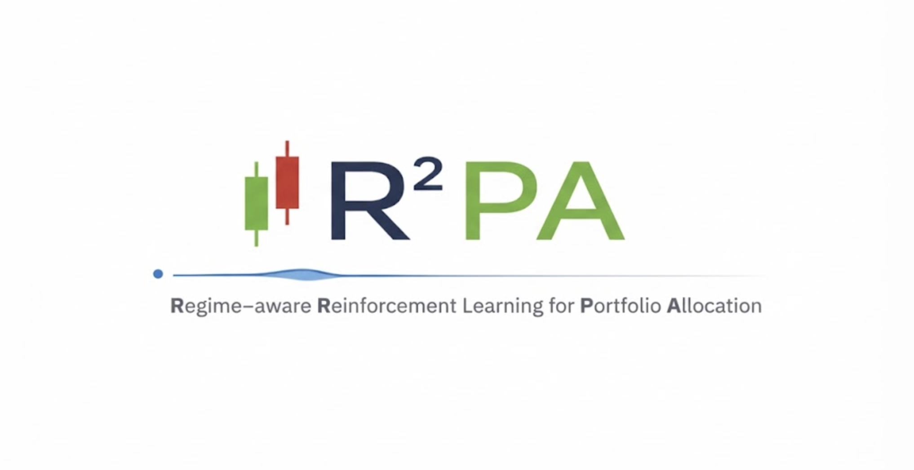
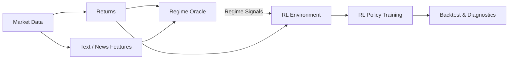

<!-- <p align="center">
  
</p> -->

<h1 align="center">R²PA: Regime-aware Reinforcement Learning for Portfolio Allocation</h1>

<p align="center">
  <a href="LICENSE">
    
  </a>
  <a href="https://github.com/PrayYoung/Portfolio-RL-Agent-Lab/stargazers">
    
  </a>
  <a href="https://github.com/PrayYoung/Portfolio-RL-Agent-Lab/issues">
    
  </a>
</p>

R²PA is a **research-oriented reinforcement learning system** for portfolio allocation under **latent market regimes**.

The core idea is to **separate expensive regime inference from downstream decision learning**:

- Market regimes are inferred by a pluggable **Regime Oracle** (heuristics or local LLMs)
- Regime signals are consumed as structured state by an RL portfolio policy (**PPO/A2C/SAC/TD3**)
- Training-time intelligence is decoupled from inference-time execution

This repo serves as a sandbox for studying **regime-aware decision policies**, not as a trading bot or alpha signal generator.

## Why R²PA

Most RL trading examples attempt to learn market structure end-to-end from price data.
R²PA instead treats **market regime as an explicit latent state**, supplied by an external oracle
and used to condition portfolio decisions.

This repo is designed to explore:

- **Regime-aware portfolio allocation** rather than price prediction
- **Teacher / oracle → policy** decoupling for realistic deployment constraints
- A clean, artifact-driven pipeline from data to evaluation


## Architecture (high level)



## Repository layout

- `src/portfolio_rl_agent_lab/data/` - download market data and build returns
- `src/portfolio_rl_agent_lab/text/` - news fetching, loading, and text features
- `src/portfolio_rl_agent_lab/llm/` - regime oracles and regime-feature builders
- `src/portfolio_rl_agent_lab/student/` - teacher-student distillation pipeline
- `src/portfolio_rl_agent_lab/env/` - portfolio environment definition
- `src/portfolio_rl_agent_lab/train/` - RL training entrypoints (`ppo/a2c/sac/td3`)
- `src/portfolio_rl_agent_lab/eval/` - backtest, benchmarks, diagnostics
- `src/portfolio_rl_agent_lab/infer/` - single-date allocation inference
- `src/portfolio_rl_agent_lab/pipeline/` - end-to-end workflow orchestration
- `src/portfolio_rl_agent_lab/cli/` - user-facing CLI (`r2pa ...`)
- `artifacts/` - generated data/models/logs (gitignored)

## Quickstart (uv)

```bash
uv venv --python 3.12
source .venv/bin/activate
uv sync
```

## Fast start (recommended)

```bash
uv run python -m portfolio_rl_agent_lab.data.download
uv run python -m portfolio_rl_agent_lab.data.make_dataset
uv run python -m portfolio_rl_agent_lab.text.build_text_features
uv run python -m portfolio_rl_agent_lab.llm.build_regime_features
uv run python -m portfolio_rl_agent_lab.train.train_rl --algo ppo
uv run python -m portfolio_rl_agent_lab.eval.benchmarks
uv run python -m portfolio_rl_agent_lab.eval.diagnostics
```

One-command quickstart script:

```bash
./scripts/quickstart.sh
```

Optional settings:

```bash
ALGO=sac TIMESTEPS=50000 REGIME_SOURCE=heuristic ./scripts/quickstart.sh
```

Notebook walkthrough:

```bash
notebooks/01_quickstart.ipynb
```

## Core workflows

Train with different RL algorithms:

```bash
r2pa rl train --algo ppo
r2pa rl train --algo a2c
r2pa rl train --algo sac
r2pa rl train --algo td3
```

Evaluate a trained model:

```bash
r2pa rl benchmarks --algo ppo --model artifacts/models/ppo_portfolio
r2pa rl diagnostics --algo ppo --model artifacts/models/ppo_portfolio
r2pa rl backtest --algo ppo --model artifacts/models/ppo_portfolio
```

Run inference for one date:

```bash
r2pa infer run --algo ppo --model artifacts/models/ppo_portfolio --asof 2025-12-31
```

## CLI usage

- Main command: `r2pa`
- Module fallback: `uv run python -m portfolio_rl_agent_lab.cli ...`

```bash
r2pa data download
r2pa data news-alpaca --days 5
r2pa rl train --algo ppo
r2pa rl benchmarks --algo ppo
```

## Pipeline commands

```bash
r2pa pipeline data
r2pa pipeline text
r2pa pipeline regime --source heuristic
r2pa pipeline student
r2pa pipeline rl --algo ppo
r2pa pipeline all --source heuristic --algo ppo
```

## Live inference examples

```bash
r2pa infer run --model artifacts/models/ppo_portfolio --algo ppo --asof 2025-12-31
```

Live Yahoo prices (latest date in downloaded window):
```bash
r2pa infer run --live-yahoo --lookback-days 180
```

Live Yahoo + real-time heuristic regime:
```bash
r2pa infer run --live-yahoo --lookback-days 180 --regime-source heuristic
```

Live Yahoo + live news + local LLM regime:
```bash
r2pa infer run --live-yahoo --live-news --regime-source local --news-lookback-days 5
```

Use the same ticker order as training (defaults to `CFG.tickers`).

## Notes

- Large artifacts are excluded from git: `artifacts/`, `.venv/`
- Regime Oracle is swappable without touching env/policy logic
